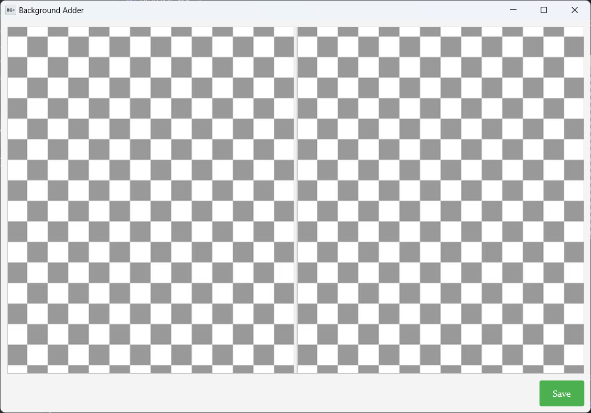

<link rel="stylesheet" href="assets/styles.css" />

# Background Adder

    

        
    

---

## Introduction

**Background Adder** is a tool that adds a white background to transparent images. With its simple interface, anyone can easily add a white background to an image.

---

## Features

- Easy Drag & Drop for image upload.
- Save the result with the same quality as the original.

---

## Installation

https://github.com/authentic0376/background_adder/releases/tag/v0.2.1

---

## Usage

1. Run the program.
2. Drag and drop a PNG or SVG image with a transparent background.
3. Click the "Execute" button to save the result.
4. The file will be saved in the Downloads directory.

---

## License

This project is licensed under the [MIT License](LICENSE).
